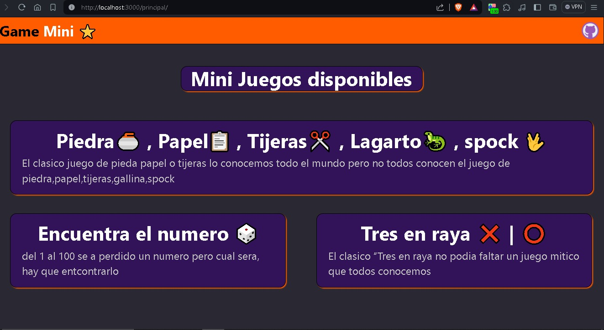
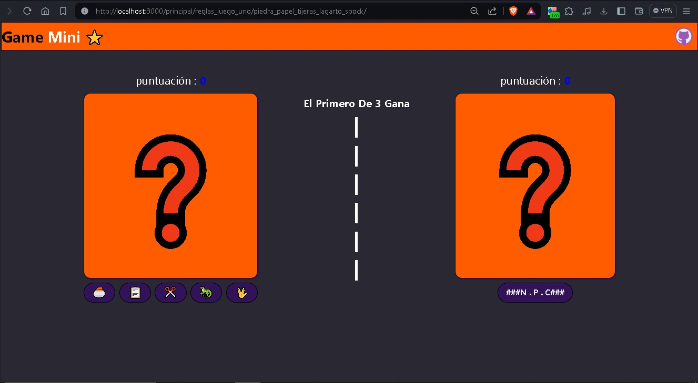
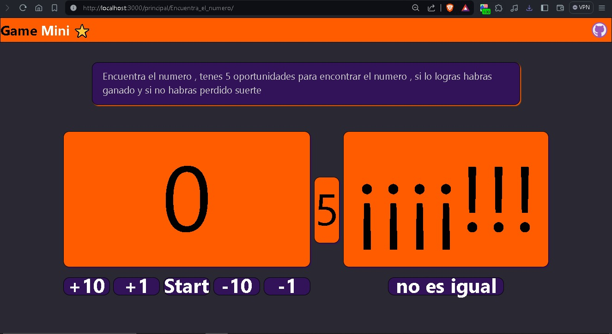
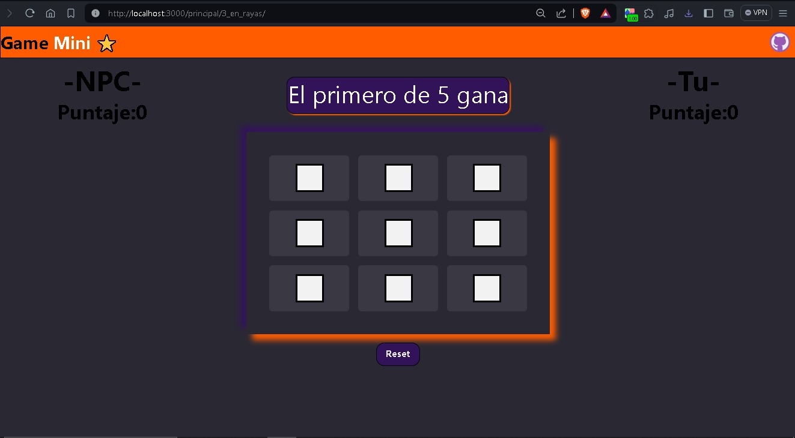

# MINI GAME 🌟

Esta web hecha con **python** y **reflex** cumple un objetivo puramente **educativo**.
Esta web esta para practicar y fortalecer mis conocimientos con el framework **reflex** en python

### TECNOLOGIAS

### EJEMPLOS VISUALES DE LOS RESULTADOS

#### PANTALLA PRINCIPAL

#### JUEGO PIEDRA🥌 PAPEL📋 TIJERAS✂ LAGARTO🦎 O SPOCK🖖

#### JUEGO ENCUENTRA EL NUMERO PERDIDO

#### JUEGO TIC TAC TOE

